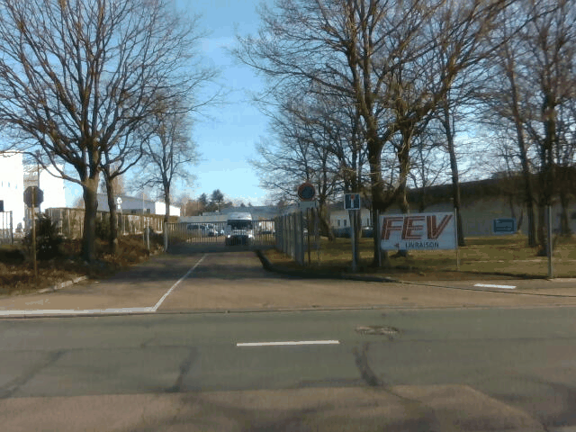

# GPS-free vehicle positioning for autonomous road public transportation based on data fusion (Submitted to [sensors](https://www.mdpi.com/journal/sensors/editorial_office)  by [ESIGELEC](https://www.esigelec.fr/))

## News :
* 2020/07/17 : A new dataset is availaible  [here](#JULY) on same road than previous.

* 2020/06/18 : A new dataset is availaible  [here](#JUNE) on same road than previous.

* 2020/05/15 : A new dataset is availaible  [here](#MAY) on same road than previous.

* April 2020 : Due to the COVID19, no dataset were done in appril.

* 2020/03/17 : A second dataset is availaible  [here](#MARCH) on same road than previous.

* 2020/02/18 : A first dataset is availaible (dataset used for paper) [here](#FEBRUARY).

## Abstract :
This paper presents an approach relying on data fusion to achieve robust vehicle positioning for road public transportation. Road public transportation vehicles navigate in a known environment defined by fixed routes associated with each line. Our approach takes advantage of this feature to enable a vehicle positioning performance compatible with navigation. Our method is optimized to run in real time on embedded plateforms. It is lighweight both from the memory and computing standpoints. The framework is highly optimized to run massively parallel. We introduced a dataset recorded monthly with ground truth sensors to evaluate the positioning performance depending on the time of the year. It provides synchronized inertial, RTK GPS and LiDAR data. Our results show that an accuracy of 5 cm can be achieved without GPS on an embedded system.

Vincent VAUCHEY¹, Yohan DUPUIS¹, Pierre MERRIAUX², Jérémy FOURRE¹, Xavier SAVATIER¹.  
¹[ESIGELEC](http://www.esigelec.fr/) , IRSEEM, Rouen, France, Normandie Univ, UNIROUEN,   
²[Leddartech](http://www.leddartech.com.),   Quebec   City,   Canada

vauchey@esigelec.fr
dupuis@esigelec.fr
fourre@esigelec.fr
savatier@esigelec.fr
pierre.merriaux@leddartech.com

Special Thanks to the members of the [SIRD](http://www.esigelec.fr/en/node/113) team : Marc DEHAIS, Anthony DESHAIS, Christophe ALEGRE, Pascal FALLA
# Datasets
Dataset Lidar/IMU/RGBD Camera done by [ESIGELEC](http://www.esigelec.fr/).

Some new dataset on same roads will be availaible each mounth.

The main reference dataset for lidar localisation is [KITTY](http://www.cvlibs.net/datasets/kitti/) dataset and is used for a lot of paper and result comparaisons beetweens localization/SLAM algorithms. The main difficultiy to use [KITTY](http://www.cvlibs.net/datasets/kitti/) dataset is the ground true accuracy which is many times more than 20 cm.

We try to provide to the community some datasets done with a reference position with best positioning systems avaiblaibles in all conditions.
The datasets ground True is done with a Landyns ([IXblue](https://www.ixblue.com/)) IMU based on fiber-optic-gyroscope (FOG), which is a technology wich ensure very low shift and noise between two gps position or when the gps accurancy become low.
In addition of this very high accurate IMU, we're also using a postprocessing application ([APPS](https://www.ixblue.com/products/apps)) coupled whith a GPS RTK [septentrio](https://www.septentrio.com/) . The goal of this application is to increase the accuracy of ground true position especially when there is tree/tunnel by doing forward/backward Kallman Filter. Landyn IMU is an "old" IMU without new firmware release but with better FOG than IMU currently in sale for civil application by [IXblue](https://www.ixblue.com/). The fact to use APPS software give the possibility to use processing algorithms used on the last IMU in sale by ([IXblue](https://www.ixblue.com/)) on our Landyn.

## IMU COMPARAISON :
| IMU  | LANDYN ([IXblue](https://www.ixblue.com/))        | ATLANS ([IXblue](https://www.ixblue.com/))  | RT 3000 ([Oxts](https://www.oxts.com/))
| :--------------- |:---------------:|:---------------:|:---------------:|
| Position when RTK lost (m)  | 0.20 (GNSS outage 60s) | 0.350 (GNSS outage 60s)  |  1.5 (SPS)
| Pitch/Roll (deg)  | 0.005 (RTK) / 0.005 (GNSS outage 60s) | 0.008 (RTK) / 0.01 (GNSS outage 60s) | 0.03
| Heading (deg)  | 0.01 | 0.020 | 0.1

#### DATASET 2020/02/18 : 
* Loop1 : Winter sun and some clouds (~1.5km)
    * [30 km/h dataset A (Download)](https://esigelec-my.sharepoint.com/:f:/g/personal/vauchey_esigelec_fr/Es6-VHjNiZBOubLo9q2Q1yMBoJ9y7BUGPe2NENOk30hMSA?e=WaCXvv)
    * [30 km/h dataset B (Download)](https://esigelec-my.sharepoint.com/:f:/g/personal/vauchey_esigelec_fr/Ep6Z90zOKYVCipE6pUHEONwB_tNcZjKDh-ARI84gIa1-2w?e=pM3R5e)
    * [40 km/h dataset (Download)](https://esigelec-my.sharepoint.com/:f:/g/personal/vauchey_esigelec_fr/EiKIg8MUu8dOqryis5O0QFYBwbs4CK7igzz_9DlccL1JoA?e=U2rvdL)
    * [50 km/h dataset (Download)](https://esigelec-my.sharepoint.com/:f:/g/personal/vauchey_esigelec_fr/EqH7B0M1s0RMvxOBO7FcqfIB1vUxszmcxPL5-d4YIP9YLg?e=0Y0XhP)
    * [Directory Tree and calibrations](#TREE)

    

    [maps preview](https://www.google.com/maps/d/embed?mid=1cAdJnWjBnK7ZZkCva8ftSXN_qYLh2o9t)
    
    

        

* Loop2 : Winter sun and some clouds with one short tunnel (~2.6 km)

    * [30 km/h dataset (Download)](https://esigelec-my.sharepoint.com/:f:/g/personal/vauchey_esigelec_fr/EpMb2wsK-NpGrhTXduyHqCsBPwkXS0PnqqerVkWSDt3SBw?e=m6i0lU)
    * [40 km/h dataset (Download)](https://esigelec-my.sharepoint.com/:f:/g/personal/vauchey_esigelec_fr/EorAB27JGmBCinzCaIx3-BABeothYaj082p_ULneF3W90A?e=rCeS9S)
    * [50 km/h dataset (Download)](https://esigelec-my.sharepoint.com/:f:/g/personal/vauchey_esigelec_fr/EuxwP_jf_ftEgLOtLrW8rEcBcGaAB138aQH0VoWES5mRTQ?e=ZVXkvt)
    * [Directory Tree and calibrations](#TREE)

    

    [maps preview](https://www.google.com/maps/d/embed?mid=1aRvGyCyWWRs2k5G5HH2M6DCKO5p3p3LA)

#### DATASET 2020/03/17 :
Images will be availaible as soon as the containment due to the COVID19 will be finish.

* Loop1 : Winter sun (~1.5km)
    * [30 km/h dataset A (Download)](https://esigelec-my.sharepoint.com/:f:/g/personal/vauchey_esigelec_fr/Epl3hNJUPLZCoy6IWMNTANUBVNQIBkzYMGPoVdiwesmI8A?e=XlI1bo)
    * [30 km/h dataset B (Download)](https://esigelec-my.sharepoint.com/:f:/g/personal/vauchey_esigelec_fr/EuCzgB2bsMNPvvh2F2uJyXsBR6S94p-nG2j4gCIl95Q2Fg?e=mbxzMa)
    * [40 km/h dataset (Download)](https://esigelec-my.sharepoint.com/:f:/g/personal/vauchey_esigelec_fr/EpUYJXIIOBBCmVeVNDTEzY0BeX3aoa13xvPoDsl7oqROzA?e=aLZPNy)
    * [50 km/h dataset (Download)](https://esigelec-my.sharepoint.com/:f:/g/personal/vauchey_esigelec_fr/ErHtWZHchZBNsbFTgj7a4N0BifbNDwc2UOtceli3BklsnQ?e=NnnGL3)
    * [Directory Tree and calibrations](#TREE)

    

* Loop2 : Winter sun  (~2.6 km) {: #funky }

    * [30 km/h dataset (Download)](https://esigelec-my.sharepoint.com/:f:/g/personal/vauchey_esigelec_fr/Ejo-BdHUM3RLllubCrM5CR4BcTmivJZkLjhOAkxU6bZ1Lw?e=zA4vqO)
    * [40 km/h dataset (Download)](https://esigelec-my.sharepoint.com/:f:/g/personal/vauchey_esigelec_fr/Empp_AwT1I5Ejkt7ORN6Hb0B3cqe_DiQUn9OsdJWGAfpMw?e=k9qW9w)
    * [50 km/h dataset (Download)](https://esigelec-my.sharepoint.com/:f:/g/personal/vauchey_esigelec_fr/EnGsngNsyfJNmc6OXIcSKVkBsYvJUXxJp0fqcYi46UyvvQ?e=iZAZHV)
    * [Directory Tree and calibrations](#TREE)

    

#### DATASET 2020/05/15 : 
* Loop1 : spring (~1.5km)

    * [30 km/h dataset A (Download)](https://esigelec-my.sharepoint.com/:f:/g/personal/vauchey_esigelec_fr/Ehk4_TSEGUpLprbhiPz7dvEBVmp5LO0mXSd0oAs_VU3YyA?e=xvPyrB)
    * [30 km/h dataset B (Download)](https://esigelec-my.sharepoint.com/:f:/g/personal/vauchey_esigelec_fr/EkCKDrejWjtFkreEdKUXZcoBg9AGwXGFrkMVNknwDI3Khw?e=cBqyIX)
    * [40 km/h dataset (Download)](https://esigelec-my.sharepoint.com/:f:/g/personal/vauchey_esigelec_fr/EovsURKzUohBqABKHQpsn5UB8t5Q9NqGS9uUIkCBWsuU6w?e=skvJbo)
    * [50 km/h dataset (Download)](https://esigelec-my.sharepoint.com/:f:/g/personal/vauchey_esigelec_fr/ErY57Q-fKgRLs42T4DEW7lkBSudoRS1dX-AN-Bbh789IlA?e=iB4QCl)
    * [Directory Tree and calibrations](#TREE)

    [maps preview](https://www.google.com/maps/d/embed?mid=1cAdJnWjBnK7ZZkCva8ftSXN_qYLh2o9t)
    Now no camera dataset will done due to the big amouth of data generated and the few interests of this kind of dataset.
* Loop2 :  spring (~1.5km)

    * [30 km/h dataset (Download)](https://esigelec-my.sharepoint.com/:f:/g/personal/vauchey_esigelec_fr/Eh6APqwLUspJvYWgu4UcRZoBCrpKAiwcRAV3wFN4JiZDGg?e=yBcejT)
    * [40 km/h dataset (Download)](https://esigelec-my.sharepoint.com/:f:/g/personal/vauchey_esigelec_fr/EhNCo4uUenVFhwUInuj6m38BBE6RaukFrZ2tbFFzNe-cmQ?e=Ikxxka))
    * [50 km/h dataset (Download)](https://esigelec-my.sharepoint.com/:f:/g/personal/vauchey_esigelec_fr/EuMEMjbX4slIgT6Pids7jR4B8IYntfxRlaOXgflDTC-PBg?e=108bDY)
    * [Directory Tree and calibrations](#TREE)

    [maps preview](https://www.google.com/maps/d/embed?mid=1aRvGyCyWWRs2k5G5HH2M6DCKO5p3p3LA)
    Now no camera dataset will done due to the big amouth of data generated and the few interests of this kind of dataset.

#### DATASET 2020/06/18 : 
* Loop1 : spring (~1.5km)
    * [30 km/h dataset A (Download)](https://esigelec-my.sharepoint.com/:f:/g/personal/vauchey_esigelec_fr/ErujLvb0ufNJqexWqK5t9osB4wiRCBqWkDhf-Hs8n9THzA?e=NRxtrb)
    * [30 km/h dataset B (Download)](https://esigelec-my.sharepoint.com/:f:/g/personal/vauchey_esigelec_fr/Ej_DTOtolhJAp4cuCuloe48Bqr5yaOOwSLM92IaGkHt6Ww?e=WiN4pq)
    * [40 km/h dataset (Download)](https://esigelec-my.sharepoint.com/:f:/g/personal/vauchey_esigelec_fr/Ev36VlHztxBLmhAFQZa3jNIBFdsxjARL92Mo55r7TsmfWA?e=tqeJ65)
    * [50 km/h dataset (Download)](https://esigelec-my.sharepoint.com/:f:/g/personal/vauchey_esigelec_fr/EqFT0gamyOxNuolLaciuR_AB-d0DoifVw99eFztqzrUBOA?e=7p7SiH)
    * [Directory Tree and calibrations](#TREE)

    [maps preview](https://www.google.com/maps/d/embed?mid=1cAdJnWjBnK7ZZkCva8ftSXN_qYLh2o9t)

* Loop2 :  spring (~1.5km)

    * [30 km/h dataset (Download)](https://esigelec-my.sharepoint.com/:f:/g/personal/vauchey_esigelec_fr/EoqI0XOX-iVIkStuW3IridIBU-ipx67q_TdDamulcjxD8A?e=JhMDlX)
    * [40 km/h dataset (Download)](https://esigelec-my.sharepoint.com/:f:/g/personal/vauchey_esigelec_fr/EpqJgCKKnYBNqiveFdPhqpkBF_OvdudCmNqk4wUeHKakoA?e=l7pa3z))
    * [50 km/h dataset (Download)](https://esigelec-my.sharepoint.com/:f:/g/personal/vauchey_esigelec_fr/EnNB1br-jmxBjUlZcbKNcKcBu4cJ3iUdwtvmgPQeHRCFZA?e=yumX0y)
    * [Directory Tree and calibrations](#TREE)

    [maps preview](https://www.google.com/maps/d/embed?mid=1aRvGyCyWWRs2k5G5HH2M6DCKO5p3p3LA)

#### DATASET 2020/07/17 :
* Loop1 : spring (~1.5km)
    * [30 km/h dataset A (Download)](https://esigelec-my.sharepoint.com/:f:/g/personal/vauchey_esigelec_fr/EnPo0-de45lLsFEhULVKXH8BoSMQkGyzWyUnkafWne-nXA?e=RdPIO4)
    * [40 km/h dataset (Download)](https://esigelec-my.sharepoint.com/:f:/g/personal/vauchey_esigelec_fr/EkZiHHTM2AFNhjh4VLVQerMB1an8b1NTCsv3M68Yrd4v-A?e=LsnKas)
    * [50 km/h dataset (Download)]()https://esigelec-my.sharepoint.com/:f:/g/personal/vauchey_esigelec_fr/EhYKzbIs4YVNkF-c2L3BxpkB8zRJdyp9SrBIsaAJ3e3ZkQ?e=pd4bL2
    * [Directory Tree and calibrations](#TREE)

    [maps preview](https://www.google.com/maps/d/embed?mid=1cAdJnWjBnK7ZZkCva8ftSXN_qYLh2o9t)

* Loop2 :  spring (~1.5km)

    * [30 km/h dataset (Download)](https://esigelec-my.sharepoint.com/:f:/g/personal/vauchey_esigelec_fr/EqL1tBvP_gxHnFfxdvM1XRYBGVH-o3FRY0xaZ3HZA-TszA?e=mQkco2)
    * [40 km/h dataset (Download)](https://esigelec-my.sharepoint.com/:f:/g/personal/vauchey_esigelec_fr/EjFRyTOLTV5Btt3PGaCe6f0Bm6DhRvmIkhGNl95GPK9u4g?e=cIR8mI)
    * [50 km/h dataset (Download)](https://esigelec-my.sharepoint.com/:f:/g/personal/vauchey_esigelec_fr/Ei3GNUNjYnxGjsq7_6wAmHcBfl2Dxfe5I9k_67UmFN-EcQ?e=AIUFGi)
    * [Directory Tree and calibrations](#TREE)

    [maps preview](https://www.google.com/maps/d/embed?mid=1aRvGyCyWWRs2k5G5HH2M6DCKO5p3p3LA)

List of sensors and software used :
* vlp16 Lidar synchronised on GPS ([Velodyne](https://velodynelidar.com/))
* GPS AsterRx-U ([septentrio](https://www.septentrio.com/))
* LANDYN IMU + post processing software APPS ([IXblue](https://www.ixblue.com/))
* D435 trigged on IMU ([intelrealsense](https://www.intelrealsense.com/depth-camera-d435))
* Peiseler odometer mounted on the right rear wheel.
* RTMAPS ([Intempora](https://intempora.com/)) Realtime acquisition software (can also be used to replay datasets)
* Rtk correction network ([teria](https://www.reseau-teria.com/reseau/)) 
* PCAN-USB ([peak-system](https://www.peak-system.com)) 

Directory Tree :
* lidarCorrectedSynchronisedImuPostPro.zip : lidar corrected  + imu + postpro synchronised
* lidarUnCompensatedImuPostProUnsynchronised : lidar uncorrected + imu + postpro unsynchronised (Download)
* vehicleOdometry : vehicle longitudinal speed (m/s) and can yaw rate (r/s) timestamped but not calibrated.

Due to European Union RGPD limitation, images were removed.

Calibrations (X forward, Y left, Z Up) :
* Transformation IMU to Lidar (Tx,Ty,Tz,Rx,Ry,Rz) : [0.989,-0.024, 2.388,0.0,0.0,-0.385]
* Car odometry and IMU have the same measurement points (rear axle)
* Transformation lidar to rgbd Camera (Tx,Ty,Tz,Rx,Ry,Rz) : [0.74,-0.43, 0.0,0.0,0.0,0.0], python code to read XYZ png file is availaible [here](code/convertionImageXYZto3D.py)
* Camera intrinsic calibration availaible [here](https://esigelec-my.sharepoint.com/:t:/g/personal/vauchey_esigelec_fr/EX0QY8SadelDo6IuNx0krBsBeEOZIGlivtcV2bfRhXYKvQ?e=E1E4CN)
### Context :
The dataset localization are datasets on same road than the French Project "Rouen Normandy Autonomous Lab" with Renault and Transdev partners:

